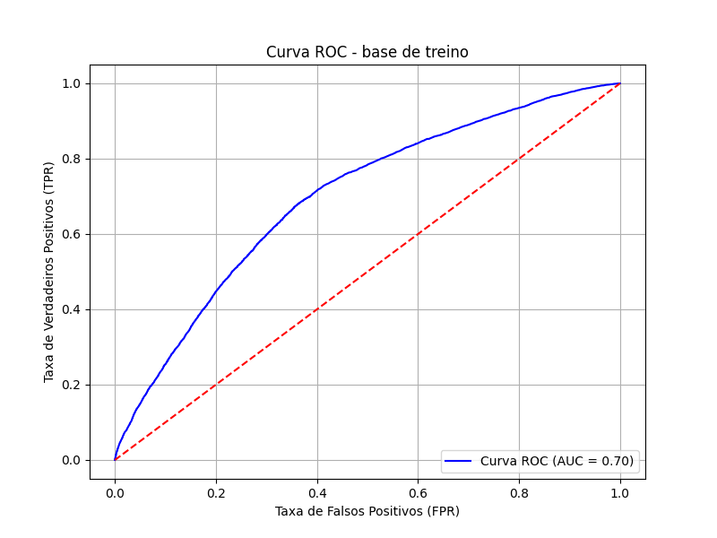
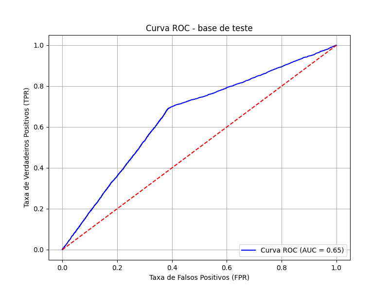

## Lung Cancer Predition across 25 countrie


```txt
 Y missing:  0
X missing: Age                              0
Years_of_Smoking                 0
Cigarettes_per_Day               0
Gender_Male                      0
Smoker_Yes                       0
Passive_Smoker_Yes               0
Family_History_Yes               0
Air_Pollution_Exposure_Low       0
Air_Pollution_Exposure_Medium    0
Indoor_Pollution_Yes             0
dtype: int64
Fitting 10 folds for each of 1 candidates, totalling 10 fits
BEST PARAMS: {'max_depth': 6, 'max_features': 8, 'min_samples_leaf': 4, 'min_samples_split': 8, 'n_estimators': 10}
BEST SCORE: 0.7857700374046587

Base de treino:
A acurácia da árvore é: 95.9%
A acurácia balanceada da árvore é: 50.0%
AUC-ROC: 69.73%
GINI: 39.46%
               precision    recall  f1-score   support

           0       0.96      1.00      0.98    127002
           1       0.00      0.00      0.00      5377

    accuracy                           0.96    132379
   macro avg       0.48      0.50      0.49    132379
weighted avg       0.92      0.96      0.94    132379


Base de teste:
A acurácia da árvore é: 95.9%
A acurácia balanceada da árvore é: 50.0%
AUC-ROC: 65.03%
GINI: 30.07%
               precision    recall  f1-score   support

           0       0.96      1.00      0.98     84669
           1       0.00      0.00      0.00      3584

    accuracy                           0.96     88253
   macro avg       0.48      0.50      0.49     88253
weighted avg       0.92      0.96      0.94     88253

```


